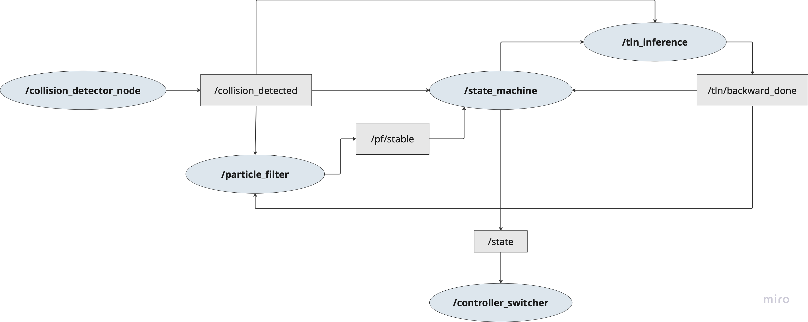

# Collision Recovery System for F1TENTH (충돌 후 복귀 시스템)

This project implements an autonomous **post-collision recovery system** for F1TENTH racing vehicles.

When a collision is detected during autonomous driving, the system automatically triggers a recovery pipeline that re-estimates the vehicle pose using a particle filter and safely returns the vehicle to the raceline without human intervention.

The system is designed as a modular ROS-based architecture, integrating collision detection, state machine control, relocalization, and controller switching.  
It is compatible with both **ForzaETH** and **F1TENTH Gym** environments.


## System Architecture



This diagram illustrates the message flow between nodes in the collision recovery system.

## Usage

### File Placement

Place the provided files into the following paths inside your `forza_ws` workspace:

- `~/forza_ws/race_stack/base_system/f110_simulator/f1tenth_gym/gym/f110_gym/envs/base_classes.py`
- `~/forza_ws/race_stack/collision_detector`
- `~/forza_ws/race_stack/controller_cpp/include/pp.hpp`
- `~/forza_ws/race_stack/controller_cpp/src/pp.cpp`
- `~/forza_ws/race_stack/controller_switcher`
- `~/forza_ws/race_stack/ofc/launch/ofc_enabled_tln.launch.py`
- `~/forza_ws/race_stack/ofc/ofc/inference_node.py`
- `~/forza_ws/race_stack/particle_filter/particle_filter/particle_filter.py`
- `~/forza_ws/race_stack/state_machine`
- `~/forza_ws/race_stack/stack_master/config/SIM/sim.yaml`

For systems **without GPU support**, use the following configuration file:

- `~/forza_ws/race_stack/stack_master/particle_filter/config/localize.yaml`


### 1. Terminal 1 – Launch Simulator and Base System

Initialize the simulation environment and base system.

```
cd ~/forza_ws/race_stack
ros2 launch stack_master base_system_launch.xml racecar_version:=OrinNano map_dir:=small_hall map_name:=small_hall_orig sim:=true
```

Use **2D Pose Estimation** in RViz to set the initial vehicle pose by dragging an arrow to the desired starting position and heading.

---

### 2. Terminal 2 – Launch Driving Algorithm and State Machine

Start the driving logic and state machine.

```
cd ~/forza_ws/race_stack
ros2 launch stack_master time_trials_launch.xml racecar_version:=OrinNano ctrl_algo:=PP
```

---

### 3. Terminal 3 – Run Collision Detector

Detect collisions based on LiDAR and IMU data and publish collision events.

```
cd ~/forza_ws/race_stack
ros2 run collision_detector collision_detector_node
```

---

### 4. Terminal 4 – Launch Controller Switcher

Select and switch the appropriate controller based on the current vehicle state.

```
cd ~/forza_ws/race_stack
ros2 launch controller_switcher controller_switcher.launch.py
```

**Important:**  
Launch Terminal 4 **after** Terminals 2 and 3 are running.  
Wait until the vehicle starts moving and a **green circle appears in the lower-left corner** of the interface before launching.

---

### 5. Triggering a Collision and Observing Recovery

If no collision occurs during normal driving, intentionally induce one by setting the **2D Pose Estimation** arrow toward a nearby wall.

This system assumes that the vehicle pose is correctly estimated **before** the collision.  
If particles converge to an incorrect location during pose estimation, reinitialize the pose and try again.
